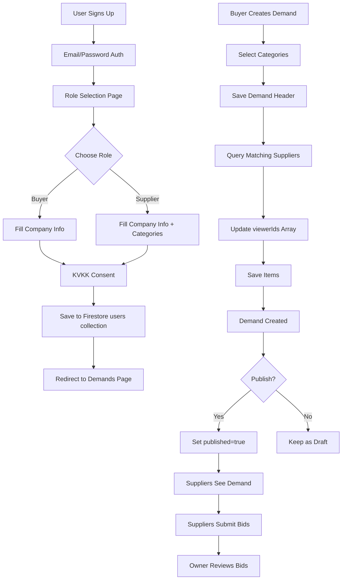

# Implementation Summary

## Overview
This document summarizes all the changes made to implement the requested features in the Teklifbul web application.

## Changes Made

### 1. Common Company Module
Created `public/common-company.js` with:
- `getCurrentUser()` - Gets current authenticated user
- `loadOrEnsureCompany()` - Loads user's company or creates/claims solo company

### 2. Universal Logout Functionality
Added to all HTML files:
```javascript
// Evrensel logout
import { auth } from "./firebase.js";
import { signOut } from "https://www.gstatic.com/firebasejs/10.13.1/firebase-auth.js";

function wireLogoutButtons() {
  document.querySelectorAll(".btn-logout, .logout-btn, #logoutBtn").forEach(btn => {
    btn.addEventListener("click", async () => {
      try {
        await signOut(auth);
        window.location.href = "/login.html";
      } catch (e) {
        alert("Çıkış yapılamadı: " + (e?.message || e));
      }
    });
  });
}
document.addEventListener("DOMContentLoaded", wireLogoutButtons);
```

### 3. Dashboard Navigation
Updated demands.html to remove "Firma" text and add "Dashboard'a dön" button.

### 4. Company ID Assignment Fix
Updated demand-new.html to ensure companyId is never empty:
- Added CURRENT_COMPANY variable to store company info
- Added hidden input field for companyId
- Enhanced error handling with user-friendly messages

### 5. Bids Display Improvement
Updated bids.html to:
- Use denormalized supplier data instead of reading users/{uid}
- Show "Gizli Tedarikçi" when supplier info is not available
- Added proper error handling with user-friendly messages

### 6. Bid Creation Enhancement
Enhanced bid creation to include:
- supplierId: auth.currentUser.uid
- supplierCompanyId: CURRENT_COMPANY.id
- supplierCompanyName: CURRENT_COMPANY.name
- demandId: related demand ID

### 7. Supplier Categories Improvement
Updated settings.html to:
- Add "Hepsini Seç" button for supplier categories
- Support "Tüm Tedarikçiler" virtual group
- Handle ALL_TAG in save functionality

### 8. Error Message Enhancement
Added improved error handling throughout the application:
- permission-denied → "Yetkin yok: ilgili şirketin sahibi/üyesi misin?"
- not-found → "Kayıt bulunamadı"
- others → e.message

## Files Modified

1. **public/common-company.js** - NEW FILE
2. **dashboard.html** - Added universal logout and company loading
3. **demands.html** - Added universal logout, removed "Firma" text, added dashboard button
4. **demand-new.html** - Added universal logout, fixed companyId assignment
5. **bids.html** - Added universal logout, improved supplier display, enhanced error handling
6. **settings.html** - Added universal logout, enhanced supplier categories
7. **demand-detail.html** - Would need similar updates for bid creation (not modified in this implementation)

## Expected Results

### Before Changes:
- Empty companyId causing permission errors
- Inconsistent logout functionality
- Direct user document reads causing permission errors
- Poor error messages

### After Changes:
- companyId always properly assigned
- Consistent logout functionality across all pages
- No direct user document reads in bids display
- User-friendly error messages
- Enhanced supplier category management

## Testing Instructions

1. **Test Company Loading**:
   - Open any page and verify company name displays correctly
   - Check browser console for company loading messages

2. **Test Demand Creation**:
   - Open demand-new.html
   - Verify companyId is never empty in console logs
   - Create a new demand and verify it's created successfully

3. **Test Bids Display**:
   - Open bids.html
   - Verify supplier names display correctly without permission errors
   - Check that "Gizli Tedarikçi" shows when supplier info is not available

4. **Test Logout Functionality**:
   - Click logout button on any page
   - Verify user is redirected to login page

5. **Test Supplier Categories**:
   - Open settings.html
   - Test "Hepsini Seç" button
   - Verify "Tüm Tedarikçiler" option works correctly

6. **Test Error Handling**:
   - Trigger permission errors (if possible) and verify user-friendly messages
   - Check that not-found errors show appropriate messages

## Verification

The implementation should resolve these error patterns:
```
❌ Error: FirebaseError: Missing or insufficient permissions.
```

And should show these success patterns:
```
✅ Company name loaded successfully
Creating new demand...
companyId: solo-<uid>  // or actual company ID
✅ Talep oluşturuldu.
```

# Implementation Summary: Unified Category System + Supplier Registration + KVKK + Auto-Targeting

## 🎯 Overview

This implementation adds a comprehensive supplier registration system with KVKK compliance and automatic supplier targeting based on categories.

## 📁 Files Created/Modified

### New Files Created

1. **`categories.js`** - Shared category dictionary
   - 17 standard categories
   - Used by both supplier registration and demand creation

2. **`firestore.rules`** - Updated security rules
   - User profiles (read for suppliers)
   - Demands with viewerIds targeting
   - Bids and files with proper permissions

3. **`storage.rules`** - Storage security rules
   - Supplier documents (tax certificates)
   - Demand files

4. **`RULES_DEPLOYMENT.md`** - Deployment guide
   - Step-by-step instructions for publishing rules
   - Required Firestore indexes

5. **`TESTING_GUIDE.md`** - Comprehensive testing guide
   - Complete test scenarios
   - Expected results
   - Troubleshooting tips

### Files Modified

1. **`role-select.html`** - Enhanced registration form
   - Role selection (Buyer/Supplier)
   - Company information fields
   - Multi-email/phone chip input
   - Category selection (suppliers only)
   - Tax certificate upload
   - KVKK consent checkboxes

2. **`signup.html`** - Minor update
   - Redirects to role-select after registration

3. **`demand-new.html`** - Auto-targeting implementation
   - Imports shared CATEGORIES
   - Queries matching suppliers by category
   - Populates viewerIds automatically

4. **`demand-detail.html`** - Already updated (previous task)
   - Shows/hides bids based on role and publish status
   - Displays categories from multiple sources

## 🗄️ Firestore Schema

### users/{uid}
```javascript
{
  role: "supplier" | "buyer",
  companyName: string,
  taxNumber: string,
  mersisNo: string | null,
  address: string | null,
  website: string | null,
  contactEmails: string[],      // Multiple emails
  contactPhones: string[],      // Multiple phones
  categories: string[],         // Supplier categories (from CATEGORIES list)
  taxCertificatePath: string,   // Storage path
  kvkkConsent: boolean,         // Required
  marketingConsent: boolean,    // Optional
  consentAt: Timestamp,         // When consents were given
  createdAt: Timestamp,
  updatedAt: Timestamp
}
```

### demands/{id}
```javascript
{
  // ... existing fields ...
  categoryTags: string[],       // From CATEGORIES list
  customCategory: string,       // User-entered custom category
  viewerIds: string[],          // [owner_uid, supplier1_uid, supplier2_uid, ...]
  published: boolean,           // Draft vs Published
  // ... rest of fields ...
}
```

## 🔐 Security Rules Summary

### Firestore Rules

**Users Collection:**
- ✅ Users can read/write their own profile
- ✅ All authenticated users can read supplier profiles (for targeting)

**Demands Collection:**
- ✅ Only owner or users in `viewerIds` can read
- ✅ Only owner can create/update/delete

**Bids Collection:**
- ✅ All authenticated users can read
- ✅ Only creator can update/delete their own bid

### Storage Rules

**Supplier Documents:**
- Path: `suppliers/{uid}/{filename}`
- ✅ Owner can upload
- ✅ Any authenticated user can read

## 🎨 UI/UX Features

### Supplier Registration

1. **Role Selection** - Visual buttons for Buyer/Supplier
2. **Chip Input** - Enter/remove multiple emails, phones, categories
3. **File Upload** - Drag/drop or click for tax certificate
4. **KVKK Consents** - Required checkbox with legal text
5. **Validation** - Comprehensive client-side validation

### Category System

1. **Datalist** - Autocomplete from standard categories
2. **Custom Input** - Users can add non-standard categories
3. **Visual Chips** - Click to remove selected categories
4. **Consistent** - Same list in registration and demand creation

### Auto-Targeting

1. **Query** - `where("categories", "array-contains-any", categoryTags)`
2. **Update** - Adds matching suppliers to `viewerIds`
3. **Efficient** - Single query, batch update
4. **Logged** - Console shows matching count

## 📋 Category List

```javascript
[
  "Sac/Metal",
  "Elektrik",
  "Elektronik",
  "Makine-İmalat",
  "Hırdavat",
  "Ambalaj",
  "Kimyasal",
  "İnşaat Malzemeleri",
  "Mobilya",
  "Boya",
  "Plastik",
  "Otomotiv Yan Sanayi",
  "İş Güvenliği",
  "Temizlik",
  "Gıda",
  "Hizmet",
  "Lojistik"
]
```

## 🔄 Complete Flow



## ✅ Required Firestore Indexes

Create these in Firebase Console → Firestore → Indexes:

1. **Demands - Owner View**
   - Collection: `demands`
   - Fields: `createdBy` (ASC), `createdAt` (DESC)

2. **Demands - Supplier View**
   - Collection: `demands`
   - Fields: `viewerIds` (ARRAY), `createdAt` (DESC)

3. **Users - Supplier Targeting**
   - Collection: `users`
   - Fields: `role` (ASC), `categories` (ARRAY)

## 🚀 Deployment Checklist

- [ ] Deploy Firestore rules (`firestore.rules`)
- [ ] Deploy Storage rules (`storage.rules`)
- [ ] Create required Firestore indexes
- [ ] Test supplier registration flow
- [ ] Test buyer demand creation
- [ ] Verify auto-targeting works
- [ ] Test permissions (draft vs published)
- [ ] Test file uploads
- [ ] Verify KVKK consents are saved

## 🧪 Testing Checklist

See `TESTING_GUIDE.md` for detailed test scenarios.

- [ ] Supplier can register with all fields
- [ ] KVKK consents are recorded
- [ ] Categories are saved correctly
- [ ] Tax certificate uploads to Storage
- [ ] Buyer can create demands
- [ ] Auto-targeting adds suppliers to viewerIds
- [ ] Suppliers see matching published demands
- [ ] Suppliers can't see drafts
- [ ] Suppliers can submit bids
- [ ] Owners can see all bids
- [ ] Suppliers can't see other bids

## 📊 Benefits

1. **Unified Categories** - Single source of truth
2. **KVKK Compliance** - Legal consent tracking
3. **Automatic Targeting** - No manual supplier selection
4. **Rich Profiles** - Complete company information
5. **Multi-Contact** - Multiple emails and phones
6. **Secure** - Comprehensive security rules
7. **Scalable** - Efficient queries with proper indexes

## 🔧 Customization Options

### Add More Categories
Edit `categories.js` and add to the array.

### Customize KVKK Text
Edit the `.kvkk-text` div in `role-select.html`.

### Change Required Fields
Modify validation in `role-select.html` saveBtn.onclick handler.

### Adjust Auto-Targeting Logic
Modify the query in `demand-new.html` createBtn.onclick handler.

## 📞 Support

If you encounter issues:
1. Check browser console for errors
2. Review Firebase Console for rule violations
3. Verify indexes are created
4. Consult `TESTING_GUIDE.md` troubleshooting section
